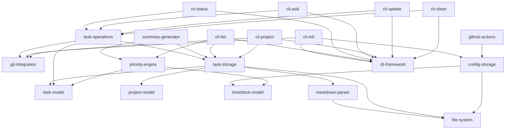

# Blueprint: Stack Product Roadmap

## Description

This blueprint defines the complete feature roadmap for Stack, a multi-project task management and prioritization system. Stack uses Git/GitHub as the storage backend, stores tasks in markdown files, and provides CLI, web, and mobile interfaces. The blueprint breaks down the product vision into discrete, independently implementable features with clear dependencies and phased implementation priorities.

## Requirements

### Product Phases

Based on the Product Strategy in `.xe/product.md`, features are organized into these phases:

1. **POC (Prove the concept works)** - Node.js CLI with core features
2. **Mainstream (Perfect the UX)** - Web application with intuitive interface  
3. **Innovation (Breakthrough capability)** - AI-powered features
4. **Platform (Extensible foundation)** - Reusable architecture and shared logic
5. **Scale (Broader markets)** - Mobile apps and broader audience support

Note: Platform capabilities are built into POC and Mainstream phases as we establish the shared TypeScript core.

### Core Entities

- **Task**: Unit of work with status, priority, impact, effort, and time block metadata
- **Project**: Collection of tasks organized into Active/Next/Backlog sections
- **TimeBlock**: Configuration for capacity allocations and task filtering
- **Summary**: Generated overview files (README.md, projects.md, stack.md, my-day.md)
- **Status**: Task state represented by emoji (🚨, ‼️, 🔺, 🚧, ⏸️, ⛔, ⏳, 👀, 🔄, 📅, ✓, ⏭️)

### Feature Dependency Graph

### Phase 1: POC - CLI Core Features

Complete feature parity with PowerShell prototype. All features below must be implemented in Phase 1.

#### F001: git-integration
- **Phase**: POC
- **Dependencies**: None
- **Complexity**: Small
- **Priority**: 1
- **Scope**: Abstraction layer for Git operations. Validates Git installation, executes Git commands (status, add, commit, push), handles Git errors with clear messages, supports dry-run mode for testing.

#### F002: file-system
- **Phase**: POC
- **Dependencies**: None
- **Complexity**: Small
- **Priority**: 2
- **Scope**: Abstraction layer for file system operations. Read/write markdown files, create/delete directories, validate file paths, handle file system errors, support cross-platform paths.

#### F003: task-model
- **Phase**: POC
- **Dependencies**: None
- **Complexity**: Small
- **Priority**: 3
- **Scope**: Core task entity and validation. Defines task data structure (title, status, priority, impact, effort, project, time block), emoji-to-status mappings, validation rules, immutability helpers.

#### F004: project-model
- **Phase**: POC
- **Dependencies**: task-model
- **Complexity**: Small
- **Priority**: 4
- **Scope**: Project entity and section structure. Defines project data structure with Active/Next/Backlog sections, project metadata, section-to-task mapping, project validation rules.

#### F005: timeblock-model
- **Phase**: POC
- **Dependencies**: None
- **Complexity**: Small
- **Priority**: 5
- **Scope**: Time block configuration entity. Defines time block structure (name, capacity, filters), capacity allocation rules, filter matching logic, validation.

#### F006: markdown-parser
- **Phase**: POC
- **Dependencies**: file-system
- **Complexity**: Medium
- **Priority**: 6
- **Scope**: Parse and manipulate markdown task files. Parses markdown with emoji status indicators, extracts task metadata, preserves document structure, supports nested subtasks, generates markdown from task objects.

#### F007: task-storage
- **Phase**: POC
- **Dependencies**: task-model, project-model, markdown-parser, file-system
- **Complexity**: Medium
- **Priority**: 7
- **Scope**: Task persistence layer using markdown files. Reads/writes tasks from/to markdown files in `tasks/` directory, maintains file structure and formatting, handles one file per project, validates task data integrity.

#### F008: config-storage
- **Phase**: POC
- **Dependencies**: file-system, timeblock-model
- **Complexity**: Small
- **Priority**: 8
- **Scope**: Configuration persistence layer. Reads/writes Stack configuration from `.stack/` directory, manages time block configuration, stores user preferences, handles GitHub Actions configuration files.

#### F009: cli-framework
- **Phase**: POC
- **Dependencies**: None
- **Complexity**: Small
- **Priority**: 9
- **Scope**: CLI framework and command parser. Parses command-line arguments, routes to command handlers, generates help text, handles global options (--dry-run, --verbose), provides consistent CLI UX.

#### F010: cli-init
- **Phase**: POC
- **Dependencies**: cli-framework, config-storage, git-integration
- **Complexity**: Small
- **Priority**: 10
- **Scope**: Initialize Stack in repository. Implements `stack init` command, creates `tasks/` directory and example task file, creates `.stack/` configuration folder, sets up GitHub Actions workflow, commits initial setup to Git.

#### F011: task-operations
- **Phase**: POC
- **Dependencies**: task-model, task-storage, git-integration
- **Complexity**: Medium
- **Priority**: 11
- **Scope**: Task lifecycle operations. Create/update/delete tasks, status transitions with validation, preserve nested task structure, commit changes to Git with descriptive messages, validate task data integrity.

#### F012: priority-engine
- **Phase**: POC
- **Dependencies**: task-model, timeblock-model
- **Complexity**: Medium
- **Priority**: 12
- **Scope**: Task prioritization logic. Calculates task priority based on status (🚨 critical highest), impact, effort, time block filtering, generates prioritized task lists, supports custom priority rules.

#### F013: cli-list
- **Phase**: POC
- **Dependencies**: cli-framework, task-storage, priority-engine
- **Complexity**: Small
- **Priority**: 13
- **Scope**: List and view tasks. Implements `stack list` and `stack` (default) commands, displays prioritized tasks from all projects, shows emoji status indicators, highlights top priority tasks, supports filtering options.

#### F014: cli-status
- **Phase**: POC
- **Dependencies**: cli-framework, task-operations
- **Complexity**: Medium
- **Priority**: 14
- **Scope**: Update task status. Implements `stack start`, `stack complete`, `stack skip`, `stack pause`, `stack resume`, `stack block` commands, updates task status with appropriate emoji, commits changes to Git.

#### F015: cli-add
- **Phase**: POC
- **Dependencies**: cli-framework, task-operations
- **Complexity**: Small
- **Priority**: 15
- **Scope**: Add new tasks. Implements `stack add` command, appends task to appropriate project file, places in correct section (Active/Next/Backlog), validates task input, commits to Git.

#### F016: cli-project
- **Phase**: POC
- **Dependencies**: cli-framework, task-storage, git-integration
- **Complexity**: Small
- **Priority**: 16
- **Scope**: Create new projects. Implements `stack project` command, creates new markdown file in `tasks/` with standard structure, includes Active/Next/Backlog sections, commits new file to Git.

#### F017: cli-update
- **Phase**: POC
- **Dependencies**: cli-framework, task-operations
- **Complexity**: Small
- **Priority**: 17
- **Scope**: Update task properties. Implements `stack update` command for changing task impact, effort, priority indicators, time block assignments, preserves task structure, commits changes to Git.

#### F018: cli-clean
- **Phase**: POC
- **Dependencies**: cli-framework, task-operations
- **Complexity**: Small
- **Priority**: 18
- **Scope**: Remove completed tasks. Implements `stack clean` command, removes tasks marked as complete (✓) or skipped (⏭️), preserves file structure, commits changes to Git with summary of removed tasks.

#### F019: summary-generator
- **Phase**: POC
- **Dependencies**: task-storage, priority-engine
- **Complexity**: Large
- **Priority**: 19
- **Scope**: Generate summary files. Creates README.md (prioritized task overview), projects.md (project status), stack.md (all tasks), my-day.md (current day focus), supports auto-generation on task changes, commits updated summaries to Git.

#### F020: github-actions
- **Phase**: POC
- **Dependencies**: config-storage
- **Complexity**: Small
- **Priority**: 20
- **Scope**: GitHub Actions workflow setup. Generates `.github/workflows/stack-summary.yml` for auto-summary generation, triggers on push to main branch, commits summary updates back to repository.

### Phase 2: Mainstream - Web Application

High-level features for Phase 2. These will be detailed when Phase 1 is complete.

#### F021: web-auth
- **Phase**: Mainstream
- **Dependencies**: None (standalone web feature)
- **Complexity**: Medium
- **Scope**: GitHub OAuth authentication for web application.

#### F022: web-ui
- **Phase**: Mainstream
- **Dependencies**: web-auth, task-storage, priority-engine
- **Complexity**: Large
- **Scope**: Visual task management interface with drag-and-drop.

#### F023: web-sync
- **Phase**: Mainstream
- **Dependencies**: web-ui, summary-generator
- **Complexity**: Medium
- **Scope**: Real-time summary updates in web interface.

#### F024: web-hosting
- **Phase**: Mainstream
- **Dependencies**: web-ui
- **Complexity**: Small
- **Scope**: GitHub Pages deployment configuration.

### Phase 3: Innovation - AI-Powered Features

High-level features for Phase 3. These will be detailed when Phase 2 is complete.

#### F025: ai-prioritization
- **Phase**: Innovation
- **Dependencies**: priority-engine, task-storage
- **Complexity**: Large
- **Scope**: Auto-prioritization based on context and deadlines using AI.

#### F026: ai-breakdown
- **Phase**: Innovation
- **Dependencies**: task-operations, ai-prioritization
- **Complexity**: Large
- **Scope**: Intelligent task breakdown into subtasks.

#### F027: ai-estimation
- **Phase**: Innovation
- **Dependencies**: task-model
- **Complexity**: Medium
- **Scope**: AI-powered effort and impact estimation.

#### F028: ai-nlp
- **Phase**: Innovation
- **Dependencies**: task-operations, ai-estimation
- **Complexity**: Large
- **Scope**: Natural language task creation and parsing.

#### F029: ai-suggestions
- **Phase**: Innovation
- **Dependencies**: task-storage, priority-engine
- **Complexity**: Medium
- **Scope**: Context-aware execution suggestions.

#### F030: ai-scheduling
- **Phase**: Innovation
- **Dependencies**: priority-engine, timeblock-model
- **Complexity**: Large
- **Scope**: Smart scheduling with time blocks using AI.

### Phase 4: Scale - Mobile Application

High-level features for Phase 4. These will be detailed when Phase 3 is complete.

#### F031: mobile-ios
- **Phase**: Scale
- **Dependencies**: task-storage, priority-engine
- **Complexity**: Large
- **Scope**: iOS native app with core task management.

#### F032: mobile-android
- **Phase**: Scale
- **Dependencies**: task-storage, priority-engine
- **Complexity**: Large
- **Scope**: Android native app with core task management.

#### F033: mobile-offline
- **Phase**: Scale
- **Dependencies**: mobile-ios, mobile-android, task-storage
- **Complexity**: Large
- **Scope**: Offline-first architecture with sync.

#### F034: mobile-notifications
- **Phase**: Scale
- **Dependencies**: mobile-ios, mobile-android
- **Complexity**: Medium
- **Scope**: Push notifications for task reminders.

#### F035: mobile-voice
- **Phase**: Scale
- **Dependencies**: mobile-ios, mobile-android, task-operations
- **Complexity**: Medium
- **Scope**: Voice input for quick task capture.

## Success Criteria

- [ ] All 20 Phase 1 features documented with clear scope boundaries
- [ ] Feature dependency graph is acyclic and validated
- [ ] Features are prioritized by dependency order and business value
- [ ] Phase assignments align with Product Strategy from `.xe/product.md`
- [ ] Each feature has: ID, phase, dependencies, scope (1-2 sentences), complexity, priority
- [ ] Complexity estimates are realistic (Small: 1-2 days, Medium: 3-5 days, Large: 1-2 weeks)
- [ ] Phase 2-4 features outlined at high level for future detailed planning
- [ ] Blueprint serves as canonical roadmap for all feature development
