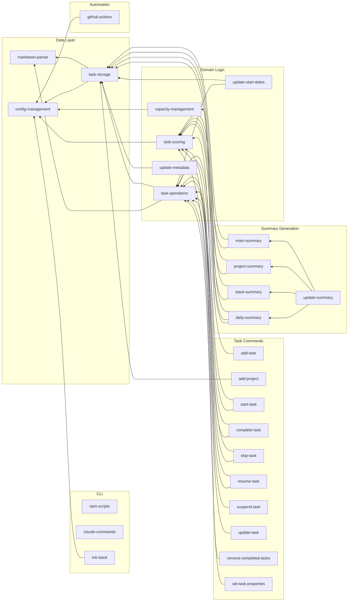

<!-- markdownlint-disable single-title -->

# Stack Product Blueprint

Stack is an AI-powered, smart task-tracking application that helps users manage and execute tasks efficiently across multiple projects. It uses Git/GitHub as the storage backend, stores tasks in markdown files, and leverages AI for intelligent task management and execution assistance.

This blueprint documents all features required to build Stack from proof-of-concept through enterprise scale, organized into phases aligned with the Product Strategy.

## Product Vision

Stack enables users to:
- Track tasks across multiple projects using plain markdown files
- Leverage AI to intelligently prioritize and suggest task execution
- Sync task data seamlessly via Git/GitHub
- Access tasks from CLI, web, and mobile interfaces
- Manage workload with time blocks and capacity planning
- Generate automated summaries showing current priorities

## Core Entities

- **Task**: Unit of work with status emojis (🚨, ‼️, 🔺, 🚧, ⏸️, ⛔, ⏳, 👀, 🔄, 📅, ✓, ⏭️), priority, impact, effort, time block metadata, and nested subtask support
- **Project**: Collection of tasks organized into Active/Next/Backlog sections with project-level metadata and priority
- **TimeBlock**: Named time periods with day/time definitions, emoji assignments, and capacity allocations for workload planning
- **Summary**: Generated overview files (README.md, projects.md, stack.md, my-day.md) showing prioritized tasks and project status
- **Configuration**: System settings in `.xe/config/stack.json` including time blocks, emoji weights, task scoring parameters

## Feature Dependency Graph

## Phase 1: POC - Complete CLI Feature Parity

All features from the PowerShell prototype must be implemented in Phase 1 to achieve complete CLI feature parity. These features provide the foundation for all future phases.

### Command Features

**init-stack**
- **Phase**: POC
- **Dependencies**: config-management
- **Complexity**: Medium
- **Scope**: Initialize Stack in a Git repository by creating `tasks/` directory with example task file, `.xe/config/` folder with stack.json, GitHub Actions workflow for auto-summary generation, and committing initial setup to Git.

**add-task**
- **Phase**: POC
- **Dependencies**: task-operations
- **Complexity**: Small
- **Scope**: Add new task to appropriate project file, placing in correct section (Active/Next/Backlog), validating task input, and committing to Git with descriptive message.

**add-project**
- **Phase**: POC
- **Dependencies**: task-storage
- **Complexity**: Small
- **Scope**: Create new project markdown file in `tasks/` with standard Active/Next/Backlog structure, project metadata, and commit new file to Git.

**start-task**
- **Phase**: POC
- **Dependencies**: task-operations, task-scoring
- **Complexity**: Small
- **Scope**: Mark the current top-priority task as in progress by adding 🚧 emoji, preserving task hierarchy and content, and triggering automatic summary regeneration.

**complete-task**
- **Phase**: POC
- **Dependencies**: task-operations, task-scoring
- **Complexity**: Small
- **Scope**: Mark top task as completed by changing checkbox from `[ ]` to `[x]`, removing 🚧 emoji if present, regenerating summaries, and promoting next priority task to top of stack.

**skip-task**
- **Phase**: POC
- **Dependencies**: task-operations, task-scoring
- **Complexity**: Small
- **Scope**: Park current top task by marking with 🅿️ emoji, promoting next task to top of stack, and regenerating summaries to reflect new priority order.

**resume-task**
- **Phase**: POC
- **Dependencies**: task-operations, task-scoring
- **Complexity**: Small
- **Scope**: Resume a parked (🅿️) or suspended (⏸️) task by removing status emoji and optionally adding 🚧 in-progress emoji, triggering summary regeneration.

**suspend-task**
- **Phase**: POC
- **Dependencies**: task-operations
- **Complexity**: Small
- **Scope**: Temporarily pause a task by adding ⏸️ emoji, preserving task content and hierarchy, and updating summaries to exclude suspended tasks from active displays.

**update-task**
- **Phase**: POC
- **Dependencies**: task-operations
- **Complexity**: Small
- **Scope**: Update task properties including priority indicators, impact, effort, time block assignments, preserving task structure and committing changes to Git.

**remove-completed-tasks**
- **Phase**: POC
- **Dependencies**: task-operations
- **Complexity**: Small
- **Scope**: Remove tasks marked as complete ([x]) or skipped (⏭️) from project files, preserving file structure and committing with summary of removed tasks.

**set-task-properties**
- **Phase**: POC
- **Dependencies**: task-operations
- **Complexity**: Small
- **Scope**: Set specific task metadata properties (priority, impact, effort, time blocks, status) with validation and structured property format.

### Summary Features

**main-summary**
- **Phase**: POC
- **Dependencies**: task-storage, task-scoring
- **Complexity**: Large
- **Scope**: Generate README.md with prioritized task overview showing top tasks across all projects, using emoji status indicators and intelligent task ordering.

**project-summary**
- **Phase**: POC
- **Dependencies**: task-storage, task-scoring
- **Complexity**: Medium
- **Scope**: Generate projects.md with project status overview showing active/next/backlog task counts, project priorities, and high-level progress tracking.

**stack-summary**
- **Phase**: POC
- **Dependencies**: task-storage, task-scoring
- **Complexity**: Large
- **Scope**: Generate stack.md with comprehensive view of all tasks organized by project, including all metadata, status, priority, impact, effort, and time blocks.

**daily-summary**
- **Phase**: POC
- **Dependencies**: task-storage, task-scoring, capacity-management
- **Complexity**: Medium
- **Scope**: Generate my-day.md showing current day focus based on time blocks, capacity allocations, and task priorities for daily execution planning.

**update-summary**
- **Phase**: POC
- **Dependencies**: main-summary, project-summary, stack-summary, daily-summary
- **Complexity**: Small
- **Scope**: Orchestrator that regenerates all summary files (README.md, projects.md, stack.md, my-day.md) in correct order, triggered after any task change.

### Infrastructure Features

**task-scoring**
- **Phase**: POC
- **Dependencies**: config-management
- **Complexity**: Medium
- **Scope**: Calculate task priority scores using configurable emoji weights (Priority, Status, Effort, Impact, TimeBlocks, Special categories), project bonuses, and placement scoring with hierarchical emoji aggregation.

**capacity-management**
- **Phase**: POC
- **Dependencies**: config-management
- **Complexity**: Medium
- **Scope**: Unified capacity and time block management system with flexible time-based filtering, day/time definitions, emoji assignments, and capacity allocations for workload planning.

**config-management**
- **Phase**: POC
- **Dependencies**: None
- **Complexity**: Small
- **Scope**: Centralized configuration management using .xe/config/stack.json for all Stack settings including time blocks, emoji weights, task scoring parameters, and calendar integration.

**markdown-parser**
- **Phase**: POC
- **Dependencies**: None
- **Complexity**: Medium
- **Scope**: Parse and manipulate markdown task files with emoji status indicators, extract task metadata, preserve document structure, support nested subtasks, and generate markdown from task objects.

**task-storage**
- **Phase**: POC
- **Dependencies**: markdown-parser, config-management
- **Complexity**: Small
- **Scope**: Task persistence layer reading/writing tasks from/to markdown files in `tasks/` directory, maintaining file structure and formatting, with one file per project.

**task-operations**
- **Phase**: POC
- **Dependencies**: task-storage, markdown-parser
- **Complexity**: Small
- **Scope**: Core task lifecycle operations (create/update/delete), status transitions with validation, preserve nested task structure, and Git commit orchestration with descriptive messages.

**update-metadata**
- **Phase**: POC
- **Dependencies**: task-storage
- **Complexity**: Small
- **Scope**: Task metadata management for tracking task properties, timestamps, and structured metadata fields across all task files.

**update-start-dates**
- **Phase**: POC
- **Dependencies**: task-storage, task-operations
- **Complexity**: Small
- **Scope**: Start date tracking for tasks, updating timestamps when tasks begin, and maintaining start date history for time tracking and analytics.

### Integration Features

**github-actions**
- **Phase**: POC
- **Dependencies**: config-management
- **Complexity**: Small
- **Scope**: GitHub Actions workflow setup generating `.github/workflows/stack-summary.yml` for auto-summary generation, triggering on push to main, and committing summary updates back to repository.

**npm-scripts**
- **Phase**: POC
- **Dependencies**: None
- **Complexity**: Small
- **Scope**: NPM script integration providing CLI access via `npm run {command}` with interactive parameter prompts, consistent with Stack automation patterns.

**claude-commands**
- **Phase**: POC
- **Dependencies**: None
- **Complexity**: Small
- **Scope**: Claude Code command integration enabling AI-assisted execution via `/stack:{command}` commands with guided parameter collection and usage examples.

## Phase 2: Mainstream - Web Application

High-level features for Phase 2. These will be detailed when Phase 1 is complete.

**web-auth**
- **Phase**: Mainstream
- **Dependencies**: None
- **Complexity**: Medium
- **Scope**: GitHub OAuth authentication for web application.

**web-ui**
- **Phase**: Mainstream
- **Dependencies**: web-auth, task-storage, task-scoring
- **Complexity**: Large
- **Scope**: Visual task management interface with drag-and-drop organization.

**web-sync**
- **Phase**: Mainstream
- **Dependencies**: web-ui, update-summary
- **Complexity**: Medium
- **Scope**: Real-time summary updates in web interface.

**web-hosting**
- **Phase**: Mainstream
- **Dependencies**: web-ui
- **Complexity**: Small
- **Scope**: GitHub Pages deployment configuration for web app hosting.

## Phase 3: Innovation - AI-Powered Features

High-level features for Phase 3. These will be detailed when Phase 2 is complete.

**ai-prioritization**
- **Phase**: Innovation
- **Dependencies**: task-scoring, task-storage
- **Complexity**: Large
- **Scope**: AI-powered auto-prioritization based on context, deadlines, and user patterns.

**ai-breakdown**
- **Phase**: Innovation
- **Dependencies**: task-operations, ai-prioritization
- **Complexity**: Large
- **Scope**: Intelligent task breakdown into subtasks with dependency analysis.

**ai-estimation**
- **Phase**: Innovation
- **Dependencies**: task-operations
- **Complexity**: Medium
- **Scope**: AI-powered effort and impact estimation with explanations.

**ai-nlp**
- **Phase**: Innovation
- **Dependencies**: task-operations, ai-estimation
- **Complexity**: Large
- **Scope**: Natural language task creation and parsing for quick capture.

**ai-suggestions**
- **Phase**: Innovation
- **Dependencies**: task-storage, task-scoring
- **Complexity**: Medium
- **Scope**: Context-aware execution suggestions based on user patterns and task history.

**ai-scheduling**
- **Phase**: Innovation
- **Dependencies**: task-scoring, capacity-management
- **Complexity**: Large
- **Scope**: Smart scheduling with time blocks using AI-powered calendar optimization.

## Phase 4: Scale - Mobile Applications

High-level features for Phase 4. These will be detailed when Phase 3 is complete.

**mobile-ios**
- **Phase**: Scale
- **Dependencies**: task-storage, task-scoring
- **Complexity**: Large
- **Scope**: iOS native app with core task management capabilities.

**mobile-android**
- **Phase**: Scale
- **Dependencies**: task-storage, task-scoring
- **Complexity**: Large
- **Scope**: Android native app with core task management capabilities.

**mobile-offline**
- **Phase**: Scale
- **Dependencies**: mobile-ios, mobile-android, task-storage
- **Complexity**: Large
- **Scope**: Offline-first architecture with bidirectional sync.

**mobile-notifications**
- **Phase**: Scale
- **Dependencies**: mobile-ios, mobile-android
- **Complexity**: Medium
- **Scope**: Push notifications for task reminders and deadline alerts.

**mobile-voice**
- **Phase**: Scale
- **Dependencies**: mobile-ios, mobile-android, task-operations
- **Complexity**: Medium
- **Scope**: Voice input for quick task capture using native speech recognition.

## Success Criteria

- All Phase 1 (POC) features documented with clear scope boundaries (1-2 sentences each)
- Feature dependency graph is acyclic and organized by system components
- Features aligned with Product Strategy from `.xe/product.md`
- Each feature includes: ID (kebab-case), phase, dependencies, scope, complexity
- Complexity estimates are realistic (Small: 1-2 days, Medium: 3-5 days, Large: 1-2 weeks)
- Phase 2-4 features outlined at high level
- Blueprint captures all PowerShell prototype capabilities from `../todo/.xe/specs`
