```mermaid
graph TD
    %% Tier 0 - Foundation
    config-management[F019: config-management]
    markdown-parser[F020: markdown-parser]
    npm-scripts[F026: npm-scripts]
    claude-commands[F027: claude-commands]

    %% Tier 1 - Storage
    task-storage[F021: task-storage]

    %% Tier 2 - Core Operations
    task-operations[F022: task-operations]
    task-scoring[F017: task-scoring]
    capacity-management[F018: capacity-management]
    update-metadata[F023: update-metadata]
    update-start-dates[F024: update-start-dates]

    %% Tier 3 - Commands
    init-stack[F001: init-stack]
    add-project[F003: add-project]
    add-task[F002: add-task]
    start-task[F004: start-task]
    complete-task[F005: complete-task]
    skip-task[F006: skip-task]
    resume-task[F007: resume-task]
    suspend-task[F008: suspend-task]
    update-task[F009: update-task]
    remove-completed-tasks[F010: remove-completed-tasks]
    set-task-properties[F011: set-task-properties]

    %% Tier 4 - Summaries
    main-summary[F012: main-summary]
    project-summary[F013: project-summary]
    stack-summary[F014: stack-summary]
    daily-summary[F015: daily-summary]

    %% Tier 5 - Orchestration
    update-summary[F016: update-summary]
    github-actions[F025: github-actions]

    %% Dependencies
    task-storage --> markdown-parser
    task-storage --> config-management

    task-operations --> task-storage
    task-operations --> markdown-parser

    task-scoring --> config-management

    capacity-management --> config-management

    update-metadata --> markdown-parser
    update-metadata --> task-storage

    update-start-dates --> markdown-parser
    update-start-dates --> task-storage
    update-start-dates --> task-operations

    add-task --> markdown-parser
    add-task --> task-storage
    add-task --> task-operations

    add-project --> markdown-parser
    add-project --> task-storage

    start-task --> markdown-parser
    start-task --> task-storage
    start-task --> task-operations
    start-task --> task-scoring

    complete-task --> markdown-parser
    complete-task --> task-storage
    complete-task --> task-operations
    complete-task --> task-scoring

    skip-task --> markdown-parser
    skip-task --> task-storage
    skip-task --> task-operations
    skip-task --> task-scoring

    resume-task --> markdown-parser
    resume-task --> task-storage
    resume-task --> task-operations
    resume-task --> task-scoring

    suspend-task --> markdown-parser
    suspend-task --> task-storage
    suspend-task --> task-operations

    update-task --> markdown-parser
    update-task --> task-storage
    update-task --> task-operations

    remove-completed-tasks --> markdown-parser
    remove-completed-tasks --> task-storage
    remove-completed-tasks --> task-operations

    set-task-properties --> markdown-parser
    set-task-properties --> task-storage
    set-task-properties --> task-operations

    main-summary --> markdown-parser
    main-summary --> task-storage
    main-summary --> task-scoring

    project-summary --> markdown-parser
    project-summary --> task-storage
    project-summary --> task-scoring

    stack-summary --> markdown-parser
    stack-summary --> task-storage
    stack-summary --> task-scoring

    daily-summary --> markdown-parser
    daily-summary --> task-storage
    daily-summary --> task-scoring
    daily-summary --> capacity-management

    update-summary --> main-summary
    update-summary --> project-summary
    update-summary --> stack-summary
    update-summary --> daily-summary

    github-actions --> config-management
```

# Blueprint: Stack Product Roadmap

## Description

This blueprint defines the complete feature roadmap for Stack, a Git-based task management system that helps users manage and prioritize tasks across multiple projects. Stack uses markdown files for storage, provides CLI/web/mobile interfaces, and leverages AI for intelligent task management.

The blueprint breaks down the product vision into discrete, independently implementable features organized into phases aligned with the Product Strategy from `.xe/product.md`.

## Requirements

### Core Entities

- **Task**: Unit of work with status emojis (🚨, ‼️, 🔺, 🚧, ⏸️, ⛔, ⏳, 👀, 🔄, 📅, ✓, ⏭️), priority, impact, effort, time block metadata, and nested subtask support
- **Project**: Collection of tasks organized into Active/Next/Backlog sections with project-level metadata and priority
- **TimeBlock**: Named time periods with day/time definitions, emoji assignments, and capacity allocations for workload planning
- **Summary**: Generated overview files (README.md, projects.md, stack.md, my-day.md) showing prioritized tasks and project status
- **Configuration**: System settings in `.xe/config/stack.json` including time blocks, emoji weights, task scoring parameters

### Feature Dependency Graph

### Phase 1: POC - Complete CLI Feature Parity

All features from the PowerShell prototype must be implemented in Phase 1 to achieve complete CLI feature parity.

#### Command Features

**F001: init-stack**
- **Phase**: POC
- **Dependencies**: None
- **Complexity**: Medium
- **Priority**: 1
- **Scope**: Initialize Stack in a Git repository by creating `tasks/` directory with example task file, `.xe/config/` folder with stack.json, GitHub Actions workflow for auto-summary generation, and committing initial setup to Git.

**F002: add-task**
- **Phase**: POC
- **Dependencies**: markdown-parser, task-storage, task-operations
- **Complexity**: Small
- **Priority**: 2
- **Scope**: Add new task to appropriate project file, placing in correct section (Active/Next/Backlog), validating task input, and committing to Git with descriptive message.

**F003: add-project**
- **Phase**: POC
- **Dependencies**: markdown-parser, task-storage
- **Complexity**: Small
- **Priority**: 3
- **Scope**: Create new project markdown file in `tasks/` with standard Active/Next/Backlog structure, project metadata, and commit new file to Git.

**F004: start-task**
- **Phase**: POC
- **Dependencies**: markdown-parser, task-storage, task-operations, task-scoring
- **Complexity**: Small
- **Priority**: 4
- **Scope**: Mark the current top-priority task as in progress by adding 🚧 emoji, preserving task hierarchy and content, and triggering automatic summary regeneration.

**F005: complete-task**
- **Phase**: POC
- **Dependencies**: markdown-parser, task-storage, task-operations, task-scoring
- **Complexity**: Small
- **Priority**: 5
- **Scope**: Mark top task as completed by changing checkbox from `[ ]` to `[x]`, removing 🚧 emoji if present, regenerating summaries, and promoting next priority task to top of stack.

**F006: skip-task**
- **Phase**: POC
- **Dependencies**: markdown-parser, task-storage, task-operations, task-scoring
- **Complexity**: Small
- **Priority**: 6
- **Scope**: Park current top task by marking with 🅿️ emoji, promoting next task to top of stack, and regenerating summaries to reflect new priority order.

**F007: resume-task**
- **Phase**: POC
- **Dependencies**: markdown-parser, task-storage, task-operations, task-scoring
- **Complexity**: Small
- **Priority**: 7
- **Scope**: Resume a parked (🅿️) or suspended (⏸️) task by removing status emoji and optionally adding 🚧 in-progress emoji, triggering summary regeneration.

**F008: suspend-task**
- **Phase**: POC
- **Dependencies**: markdown-parser, task-storage, task-operations
- **Complexity**: Small
- **Priority**: 8
- **Scope**: Temporarily pause a task by adding ⏸️ emoji, preserving task content and hierarchy, and updating summaries to exclude suspended tasks from active displays.

**F009: update-task**
- **Phase**: POC
- **Dependencies**: markdown-parser, task-storage, task-operations
- **Complexity**: Small
- **Priority**: 9
- **Scope**: Update task properties including priority indicators, impact, effort, time block assignments, preserving task structure and committing changes to Git.

**F010: remove-completed-tasks**
- **Phase**: POC
- **Dependencies**: markdown-parser, task-storage, task-operations
- **Complexity**: Small
- **Priority**: 10
- **Scope**: Remove tasks marked as complete ([x]) or skipped (⏭️) from project files, preserving file structure and committing with summary of removed tasks.

**F011: set-task-properties**
- **Phase**: POC
- **Dependencies**: markdown-parser, task-storage, task-operations
- **Complexity**: Small
- **Priority**: 11
- **Scope**: Set specific task metadata properties (priority, impact, effort, time blocks, status) with validation and structured property format.

#### Summary Features

**F012: main-summary**
- **Phase**: POC
- **Dependencies**: markdown-parser, task-storage, task-scoring
- **Complexity**: Large
- **Priority**: 12
- **Scope**: Generate README.md with prioritized task overview showing top tasks across all projects, using emoji status indicators and intelligent task ordering.

**F013: project-summary**
- **Phase**: POC
- **Dependencies**: markdown-parser, task-storage, task-scoring
- **Complexity**: Medium
- **Priority**: 13
- **Scope**: Generate projects.md with project status overview showing active/next/backlog task counts, project priorities, and high-level progress tracking.

**F014: stack-summary**
- **Phase**: POC
- **Dependencies**: markdown-parser, task-storage, task-scoring
- **Complexity**: Large
- **Priority**: 14
- **Scope**: Generate stack.md with comprehensive view of all tasks organized by project, including all metadata, status, priority, impact, effort, and time blocks.

**F015: daily-summary**
- **Phase**: POC
- **Dependencies**: markdown-parser, task-storage, task-scoring, capacity-management
- **Complexity**: Medium
- **Priority**: 15
- **Scope**: Generate my-day.md showing current day focus based on time blocks, capacity allocations, and task priorities for daily execution planning.

**F016: update-summary**
- **Phase**: POC
- **Dependencies**: main-summary, project-summary, stack-summary, daily-summary
- **Complexity**: Small
- **Priority**: 16
- **Scope**: Orchestrator that regenerates all summary files (README.md, projects.md, stack.md, my-day.md) in correct order, triggered after any task change.

#### Infrastructure Features

**F017: task-scoring**
- **Phase**: POC
- **Dependencies**: config-management
- **Complexity**: Medium
- **Priority**: 17
- **Scope**: Calculate task priority scores using configurable emoji weights (Priority, Status, Effort, Impact, TimeBlocks, Special categories), project bonuses, and placement scoring with hierarchical emoji aggregation.

**F018: capacity-management**
- **Phase**: POC
- **Dependencies**: config-management
- **Complexity**: Medium
- **Priority**: 18
- **Scope**: Unified capacity and time block management system with flexible time-based filtering, day/time definitions, emoji assignments, and capacity allocations for workload planning.

**F019: config-management**
- **Phase**: POC
- **Dependencies**: None
- **Complexity**: Small
- **Priority**: 19
- **Scope**: Centralized configuration management using .xe/config/stack.json for all Stack settings including time blocks, emoji weights, task scoring parameters, and calendar integration.

**F020: markdown-parser**
- **Phase**: POC
- **Dependencies**: None
- **Complexity**: Medium
- **Priority**: 20
- **Scope**: Parse and manipulate markdown task files with emoji status indicators, extract task metadata, preserve document structure, support nested subtasks, and generate markdown from task objects.

**F021: task-storage**
- **Phase**: POC
- **Dependencies**: markdown-parser, config-management
- **Complexity**: Small
- **Priority**: 21
- **Scope**: Task persistence layer reading/writing tasks from/to markdown files in `tasks/` directory, maintaining file structure and formatting, with one file per project.

**F022: task-operations**
- **Phase**: POC
- **Dependencies**: task-storage, markdown-parser
- **Complexity**: Small
- **Priority**: 22
- **Scope**: Core task lifecycle operations (create/update/delete), status transitions with validation, preserve nested task structure, and Git commit orchestration with descriptive messages.

**F023: update-metadata**
- **Phase**: POC
- **Dependencies**: markdown-parser, task-storage
- **Complexity**: Small
- **Priority**: 23
- **Scope**: Task metadata management for tracking task properties, timestamps, and structured metadata fields across all task files.

**F024: update-start-dates**
- **Phase**: POC
- **Dependencies**: markdown-parser, task-storage, task-operations
- **Complexity**: Small
- **Priority**: 24
- **Scope**: Start date tracking for tasks, updating timestamps when tasks begin, and maintaining start date history for time tracking and analytics.

#### Integration Features

**F025: github-actions**
- **Phase**: POC
- **Dependencies**: config-management
- **Complexity**: Small
- **Priority**: 25
- **Scope**: GitHub Actions workflow setup generating `.github/workflows/stack-summary.yml` for auto-summary generation, triggering on push to main, and committing summary updates back to repository.

**F026: npm-scripts**
- **Phase**: POC
- **Dependencies**: None
- **Complexity**: Small
- **Priority**: 26
- **Scope**: NPM script integration providing CLI access via `npm run {command}` with interactive parameter prompts, consistent with Stack automation patterns.

**F027: claude-commands**
- **Phase**: POC
- **Dependencies**: None
- **Complexity**: Small
- **Priority**: 27
- **Scope**: Claude Code command integration enabling AI-assisted execution via `/stack:{command}` commands with guided parameter collection and usage examples.

### Phase 2: Mainstream - Web Application

High-level features for Phase 2. These will be detailed when Phase 1 is complete.

**F028: web-auth**
- **Phase**: Mainstream
- **Dependencies**: None
- **Complexity**: Medium
- **Scope**: GitHub OAuth authentication for web application.

**F029: web-ui**
- **Phase**: Mainstream
- **Dependencies**: web-auth, task-storage, task-scoring
- **Complexity**: Large
- **Scope**: Visual task management interface with drag-and-drop organization.

**F030: web-sync**
- **Phase**: Mainstream
- **Dependencies**: web-ui, update-summary
- **Complexity**: Medium
- **Scope**: Real-time summary updates in web interface.

**F031: web-hosting**
- **Phase**: Mainstream
- **Dependencies**: web-ui
- **Complexity**: Small
- **Scope**: GitHub Pages deployment configuration for web app hosting.

### Phase 3: Innovation - AI-Powered Features

High-level features for Phase 3. These will be detailed when Phase 2 is complete.

**F032: ai-prioritization**
- **Phase**: Innovation
- **Dependencies**: task-scoring, task-storage
- **Complexity**: Large
- **Scope**: AI-powered auto-prioritization based on context, deadlines, and user patterns.

**F033: ai-breakdown**
- **Phase**: Innovation
- **Dependencies**: task-operations, ai-prioritization
- **Complexity**: Large
- **Scope**: Intelligent task breakdown into subtasks with dependency analysis.

**F034: ai-estimation**
- **Phase**: Innovation
- **Dependencies**: task-operations
- **Complexity**: Medium
- **Scope**: AI-powered effort and impact estimation with explanations.

**F035: ai-nlp**
- **Phase**: Innovation
- **Dependencies**: task-operations, ai-estimation
- **Complexity**: Large
- **Scope**: Natural language task creation and parsing for quick capture.

**F036: ai-suggestions**
- **Phase**: Innovation
- **Dependencies**: task-storage, task-scoring
- **Complexity**: Medium
- **Scope**: Context-aware execution suggestions based on user patterns and task history.

**F037: ai-scheduling**
- **Phase**: Innovation
- **Dependencies**: task-scoring, capacity-management
- **Complexity**: Large
- **Scope**: Smart scheduling with time blocks using AI-powered calendar optimization.

### Phase 4: Scale - Mobile Applications

High-level features for Phase 4. These will be detailed when Phase 3 is complete.

**F038: mobile-ios**
- **Phase**: Scale
- **Dependencies**: task-storage, task-scoring
- **Complexity**: Large
- **Scope**: iOS native app with core task management capabilities.

**F039: mobile-android**
- **Phase**: Scale
- **Dependencies**: task-storage, task-scoring
- **Complexity**: Large
- **Scope**: Android native app with core task management capabilities.

**F040: mobile-offline**
- **Phase**: Scale
- **Dependencies**: mobile-ios, mobile-android, task-storage
- **Complexity**: Large
- **Scope**: Offline-first architecture with bidirectional sync.

**F041: mobile-notifications**
- **Phase**: Scale
- **Dependencies**: mobile-ios, mobile-android
- **Complexity**: Medium
- **Scope**: Push notifications for task reminders and deadline alerts.

**F042: mobile-voice**
- **Phase**: Scale
- **Dependencies**: mobile-ios, mobile-android, task-operations
- **Complexity**: Medium
- **Scope**: Voice input for quick task capture using native speech recognition.

## Success Criteria

- [ ] All Phase 1 (POC) features documented with clear scope boundaries (1-2 sentences each)
- [ ] Feature dependency graph is acyclic and organized into 6 tiers
- [ ] Features prioritized by dependency order first, then business value
- [ ] Phase assignments align with Product Strategy from `.xe/product.md`
- [ ] Each feature has: ID (kebab-case), phase, dependencies, scope, complexity, priority
- [ ] Complexity estimates are realistic (Small: 1-2 days, Medium: 3-5 days, Large: 1-2 weeks)
- [ ] Phase 2-4 features outlined at high level with minimal feature list
- [ ] Blueprint captures all PowerShell prototype capabilities from `../todo/.xe/specs`
- [ ] 27 Phase 1 features represent complete CLI feature parity
