<!-- markdownlint-disable single-title -->

# Feature: Stack Product Blueprint

## Problem

Stack needs a comprehensive, phased roadmap that breaks down the complete product vision into discrete, implementable features with clear dependencies and priorities to enable systematic development from POC to enterprise scale.

## Goals

- Document all features required for complete CLI feature parity with the PowerShell prototype in Phase 1 (POC)
- Establish clear feature dependencies forming an acyclic dependency graph for parallel execution
- Define Phase 2-5 features at a high level for future detailed planning
- Align feature phases with Product Strategy priorities (POC → Mainstream → Innovation → Platform → Enterprise → Scale)
- Enable systematic feature implementation via `/catalyst:rollout {feature-id}` workflow

Explicit non-goals:

- Implementing features during blueprint creation (implementation happens after blueprint PR is merged)
- Detailing Phase 2+ features completely (will be detailed when prior phase completes)
- Changing the core PowerShell prototype behavior (preserve existing functionality)

## Scenario

- As a product manager, I need a complete feature roadmap so that I can plan releases and communicate progress to stakeholders.
  - Outcome: Blueprint spec.md serves as single source of truth for all planned features across all phases
- As an architect, I need feature dependencies clearly mapped so that I can ensure features are built in the correct order without blocking work.
  - Outcome: Dependency graph with tiers enables parallel feature development where dependencies allow
- As an engineer, I need clear feature scope boundaries so that I can implement features without scope creep or ambiguity.
  - Outcome: Each feature has 1-2 sentence scope description defining clear boundaries
- As a team, we need Phase 1 features to match PowerShell prototype capabilities so that we achieve complete CLI feature parity.
  - Outcome: All commands, summaries, and workflows from PowerShell prototype are represented as discrete features

## Success Criteria

- All Phase 1 (POC) features documented with clear scope boundaries (1-2 sentences each)
- Feature dependency graph is acyclic and validated with mermaid diagram
- Features are prioritized by dependency order first, then business value
- Phase assignments align with Product Strategy from `.xe/product.md`
- Each feature includes: ID (kebab-case), phase, dependencies, scope, complexity, priority
- Complexity estimates are realistic (Small: 1-2 days, Medium: 3-5 days, Large: 1-2 weeks)
- Phase 2-5 features outlined at high level with minimal feature list
- Blueprint captures all PowerShell prototype capabilities from `../todo/.xe/specs`

## Design principles

- **Complete feature parity first**
  > Phase 1 must implement ALL capabilities from the PowerShell prototype. No features can be deferred to later phases if they exist in the prototype. This ensures the Node.js CLI can fully replace the PowerShell version.

- **Granular feature decomposition**
  > Break features into small, independently testable units following Single Responsibility Principle. Each feature should do one thing well and be independently implementable via `/catalyst:rollout`.

- **Dependency-driven prioritization**
  > Features must be ordered by dependencies first (can't build X without Y), then by business value within the same dependency tier. This enables maximum parallelization while respecting technical constraints.

## Requirements

### Functional Requirements

#### Phase 1: POC - Complete CLI Feature Parity

**FR-1**: Blueprint MUST document all user-facing CLI commands from PowerShell prototype:
- **FR-1.1**: init-stack - Initialize Stack in a Git repository
- **FR-1.2**: add-task - Add new task to project file
- **FR-1.3**: add-project - Create new project with Active/Next/Backlog structure
- **FR-1.4**: start-task - Mark top task as in progress (🚧)
- **FR-1.5**: complete-task - Mark top task as complete ([x])
- **FR-1.6**: skip-task - Park current task and promote next (🅿️)
- **FR-1.7**: resume-task - Resume a parked or suspended task
- **FR-1.8**: suspend-task - Temporarily pause a task (⏸️)
- **FR-1.9**: update-task - Update task properties (priority, impact, effort, time blocks)
- **FR-1.10**: remove-completed-tasks - Clean up completed and skipped tasks
- **FR-1.11**: set-task-properties - Set specific task metadata

**FR-2**: Blueprint MUST document all summary generation features:
- **FR-2.1**: main-summary - Generate README.md with prioritized task overview
- **FR-2.2**: project-summary - Generate projects.md with project status
- **FR-2.3**: stack-summary - Generate stack.md with all tasks
- **FR-2.4**: daily-summary - Generate my-day.md with current day focus
- **FR-2.5**: update-summary - Orchestrator that regenerates all summaries

**FR-3**: Blueprint MUST document core infrastructure features:
- **FR-3.1**: task-scoring - Priority calculation using emoji weights
- **FR-3.2**: capacity-management - Time block configuration and filtering
- **FR-3.3**: config-management - Centralized configuration in .xe/config/stack.json
- **FR-3.4**: markdown-parser - Parse and manipulate markdown task files
- **FR-3.5**: github-actions - Workflow setup for auto-summary generation
- **FR-3.6**: update-metadata - Task metadata management
- **FR-3.7**: update-start-dates - Start date tracking for tasks

**FR-4**: Blueprint MUST document integration features:
- **FR-4.1**: npm-scripts - NPM script integration for CLI commands
- **FR-4.2**: claude-commands - Claude Code command integration

**FR-5**: Blueprint MUST include feature dependency graph showing:
- **FR-5.1**: All dependencies between features (directed edges)
- **FR-5.2**: Dependency tiers for parallel execution
- **FR-5.3**: Mermaid diagram format for visualization
- **FR-5.4**: Validation that graph is acyclic (no circular dependencies)

**FR-6**: Blueprint MUST define complexity estimates for each Phase 1 feature:
- Small: 1-2 days (simple commands, basic file operations)
- Medium: 3-5 days (parsing logic, complex workflows, integration)
- Large: 1-2 weeks (summary generation, scoring algorithms, multi-component features)

#### Phase 2-5: High-Level Feature Outline

**FR-7**: Blueprint MUST outline Phase 2 (Mainstream) features at high level:
- Web application with GitHub OAuth authentication
- Visual task management interface with drag-and-drop
- Real-time summary updates
- GitHub Pages hosting

**FR-8**: Blueprint MUST outline Phase 3 (Innovation) features at high level:
- AI-powered auto-prioritization
- Intelligent task breakdown
- Effort and impact estimation
- Natural language task creation
- Context-aware execution suggestions
- Smart scheduling with time blocks

**FR-9**: Blueprint MUST outline Phase 4 (Scale) features at high level:
- iOS and Android native apps
- Offline-first architecture with sync
- Push notifications for task reminders
- Voice input for quick capture

**FR-10**: Blueprint MUST NOT detail Phase 2+ features completely:
- Future phase features described at high level only (1 sentence each)
- Detailed planning happens when prior phase completes
- Re-run `/catalyst:blueprint` when phase completes to detail next phase

### Non-functional requirements

- **NFR-1**: Cost & usage efficiency
  - Blueprint creation must not incur API costs (no external services required)
  - Feature scope boundaries must prevent scope creep and wasted development effort

- **NFR-2**: Security
  - Not applicable - blueprint is documentation only

- **NFR-3**: Reliability
  - Feature dependencies must be accurate to prevent implementation blockers
  - Complexity estimates must be realistic to enable accurate project planning
  - All Phase 1 features must map to PowerShell prototype capabilities (no missing features)

- **NFR-4**: Performance
  - Blueprint document must be readable and navigable (< 500 lines for spec.md)
  - Feature count per phase must be manageable (target 20-30 features for Phase 1)

- **NFR-5**: Observability
  - Each feature must have clear scope description for status tracking
  - tasks.md must provide checklist for implementation progress

- **NFR-6**: Accessibility
  - Not applicable - blueprint is documentation only

- **NFR-7**: Globalization
  - Not applicable - blueprint is documentation only

- **NFR-8**: Backward compatibility
  - Phase 1 features must preserve PowerShell prototype behavior
  - Blueprint structure must follow Catalyst template format for consistency

## Key Entities

Entities owned by this feature:

- **Feature**: Discrete, independently implementable unit of functionality with ID, phase, dependencies, scope description (1-2 sentences), complexity estimate, and priority number
- **Feature Dependency Graph**: Acyclic directed graph showing which features depend on others, organized into tiers for parallel execution
- **Phase Plan**: High-level grouping of features by Product Strategy phase (POC, Mainstream, Innovation, Platform, Enterprise, Scale)

Entities from other features:

- **Product Strategy**: Phase prioritization from `.xe/product.md` defining product development sequence
- **PowerShell Prototype Features**: Existing feature specifications in `../todo/.xe/specs` serving as reference implementation

Inputs:

- Issue #4 describing product vision, user workflows, and feature requirements
- PowerShell prototype feature specs in `../todo/.xe/specs` directory
- Product Strategy from `.xe/product.md` defining phase priorities
- Catalyst template at `node_modules/@xerilium/catalyst/templates/specs/spec.md`

Outputs:

- **spec.md**: Complete feature roadmap with all features, dependencies, priorities (this file)
- **plan.md**: Implementation approach and phased rollout strategy
- **tasks.md**: Checklist of Phase 1 implementation tasks + Phase 2-5 planning tasks
- **research.md**: Product analysis and competitive research findings
- **rollout-blueprint.md**: Orchestration plan for blueprint execution

## Dependencies

- **Catalyst playbooks**: `start-blueprint.md` playbook defines blueprint creation workflow
- **PowerShell prototype**: Feature specs in `../todo/.xe/specs` define reference implementation
- **Product context**: `.xe/product.md` defines Product Strategy phase priorities
- **Catalyst templates**: `node_modules/@xerilium/catalyst/templates/specs/` define spec structure

## Phase 1: POC Features (Complete CLI Feature Parity)

### Command Features

#### F001: init-stack
- **Phase**: POC
- **Dependencies**: None
- **Complexity**: Medium
- **Priority**: 1
- **Scope**: Initialize Stack in a Git repository by creating `tasks/` directory with example task file, `.xe/config/` folder with stack.json, GitHub Actions workflow for auto-summary, and committing initial setup to Git.

#### F002: add-task
- **Phase**: POC
- **Dependencies**: markdown-parser, task-storage, task-operations
- **Complexity**: Small
- **Priority**: 2
- **Scope**: Add new task to appropriate project file, placing in correct section (Active/Next/Backlog), validating task input, and committing to Git with descriptive message.

#### F003: add-project
- **Phase**: POC
- **Dependencies**: markdown-parser, task-storage
- **Complexity**: Small
- **Priority**: 3
- **Scope**: Create new project markdown file in `tasks/` with standard Active/Next/Backlog structure, project metadata, and commit new file to Git.

#### F004: start-task
- **Phase**: POC
- **Dependencies**: markdown-parser, task-storage, task-operations, task-scoring
- **Complexity**: Small
- **Priority**: 4
- **Scope**: Mark the current top-priority task as in progress by adding 🚧 emoji, preserving task hierarchy and content, and triggering automatic summary regeneration.

#### F005: complete-task
- **Phase**: POC
- **Dependencies**: markdown-parser, task-storage, task-operations, task-scoring
- **Complexity**: Small
- **Priority**: 5
- **Scope**: Mark top task as completed by changing checkbox from `[ ]` to `[x]`, removing 🚧 emoji if present, regenerating summaries, and promoting next priority task to top of stack.

#### F006: skip-task
- **Phase**: POC
- **Dependencies**: markdown-parser, task-storage, task-operations, task-scoring
- **Complexity**: Small
- **Priority**: 6
- **Scope**: Park current top task by marking with 🅿️ emoji, promoting next task to top of stack, and regenerating summaries to reflect new priority order.

#### F007: resume-task
- **Phase**: POC
- **Dependencies**: markdown-parser, task-storage, task-operations, task-scoring
- **Complexity**: Small
- **Priority**: 7
- **Scope**: Resume a parked (🅿️) or suspended (⏸️) task by removing status emoji and optionally adding 🚧 in-progress emoji, triggering summary regeneration.

#### F008: suspend-task
- **Phase**: POC
- **Dependencies**: markdown-parser, task-storage, task-operations
- **Complexity**: Small
- **Priority**: 8
- **Scope**: Temporarily pause a task by adding ⏸️ emoji, preserving task content and hierarchy, and updating summaries to exclude suspended tasks from active displays.

#### F009: update-task
- **Phase**: POC
- **Dependencies**: markdown-parser, task-storage, task-operations
- **Complexity**: Small
- **Priority**: 9
- **Scope**: Update task properties including priority indicators, impact, effort, time block assignments, preserving task structure and committing changes to Git.

#### F010: remove-completed-tasks
- **Phase**: POC
- **Dependencies**: markdown-parser, task-storage, task-operations
- **Complexity**: Small
- **Priority**: 10
- **Scope**: Remove tasks marked as complete ([x]) or skipped (⏭️) from project files, preserving file structure and committing with summary of removed tasks.

#### F011: set-task-properties
- **Phase**: POC
- **Dependencies**: markdown-parser, task-storage, task-operations
- **Complexity**: Small
- **Priority**: 11
- **Scope**: Set specific task metadata properties (priority, impact, effort, time blocks, status) with validation and structured property format.

### Summary Features

#### F012: main-summary
- **Phase**: POC
- **Dependencies**: markdown-parser, task-storage, task-scoring
- **Complexity**: Large
- **Priority**: 12
- **Scope**: Generate README.md with prioritized task overview showing top tasks across all projects, using emoji status indicators and intelligent task ordering.

#### F013: project-summary
- **Phase**: POC
- **Dependencies**: markdown-parser, task-storage, task-scoring
- **Complexity**: Medium
- **Priority**: 13
- **Scope**: Generate projects.md with project status overview showing active/next/backlog task counts, project priorities, and high-level progress tracking.

#### F014: stack-summary
- **Phase**: POC
- **Dependencies**: markdown-parser, task-storage, task-scoring
- **Complexity**: Large
- **Priority**: 14
- **Scope**: Generate stack.md with comprehensive view of all tasks organized by project, including all metadata, status, priority, impact, effort, and time blocks.

#### F015: daily-summary
- **Phase**: POC
- **Dependencies**: markdown-parser, task-storage, task-scoring, capacity-management
- **Complexity**: Medium
- **Priority**: 15
- **Scope**: Generate my-day.md showing current day focus based on time blocks, capacity allocations, and task priorities for daily execution planning.

#### F016: update-summary
- **Phase**: POC
- **Dependencies**: main-summary, project-summary, stack-summary, daily-summary
- **Complexity**: Small
- **Priority**: 16
- **Scope**: Orchestrator that regenerates all summary files (README.md, projects.md, stack.md, my-day.md) in correct order, triggered after any task change.

### Infrastructure Features

#### F017: task-scoring
- **Phase**: POC
- **Dependencies**: config-management
- **Complexity**: Medium
- **Priority**: 17
- **Scope**: Calculate task priority scores using configurable emoji weights (Priority, Status, Effort, Impact, TimeBlocks, Special categories), project bonuses, and placement scoring with hierarchical emoji aggregation.

#### F018: capacity-management
- **Phase**: POC
- **Dependencies**: config-management
- **Complexity**: Medium
- **Priority**: 18
- **Scope**: Unified capacity and time block management system with flexible time-based filtering, day/time definitions, emoji assignments, and capacity allocations for workload planning.

#### F019: config-management
- **Phase**: POC
- **Dependencies**: None
- **Complexity**: Small
- **Priority**: 19
- **Scope**: Centralized configuration management using .xe/config/stack.json for all Stack settings including time blocks, emoji weights, task scoring parameters, and calendar integration.

#### F020: markdown-parser
- **Phase**: POC
- **Dependencies**: None
- **Complexity**: Medium
- **Priority**: 20
- **Scope**: Parse and manipulate markdown task files with emoji status indicators, extract task metadata, preserve document structure, support nested subtasks, and generate markdown from task objects.

#### F021: task-storage
- **Phase**: POC
- **Dependencies**: markdown-parser, config-management
- **Complexity**: Small
- **Priority**: 21
- **Scope**: Task persistence layer reading/writing tasks from/to markdown files in `tasks/` directory, maintaining file structure and formatting, with one file per project.

#### F022: task-operations
- **Phase**: POC
- **Dependencies**: task-storage, markdown-parser
- **Complexity**: Small
- **Priority**: 22
- **Scope**: Core task lifecycle operations (create/update/delete), status transitions with validation, preserve nested task structure, and Git commit orchestration with descriptive messages.

#### F023: update-metadata
- **Phase**: POC
- **Dependencies**: markdown-parser, task-storage
- **Complexity**: Small
- **Priority**: 23
- **Scope**: Task metadata management for tracking task properties, timestamps, and structured metadata fields across all task files.

#### F024: update-start-dates
- **Phase**: POC
- **Dependencies**: markdown-parser, task-storage, task-operations
- **Complexity**: Small
- **Priority**: 24
- **Scope**: Start date tracking for tasks, updating timestamps when tasks begin, and maintaining start date history for time tracking and analytics.

### Integration Features

#### F025: github-actions
- **Phase**: POC
- **Dependencies**: config-management
- **Complexity**: Small
- **Priority**: 25
- **Scope**: GitHub Actions workflow setup generating `.github/workflows/stack-summary.yml` for auto-summary generation, triggering on push to main, and committing summary updates back to repository.

#### F026: npm-scripts
- **Phase**: POC
- **Dependencies**: None
- **Complexity**: Small
- **Priority**: 26
- **Scope**: NPM script integration providing CLI access via `npm run {command}` with interactive parameter prompts, consistent with Stack automation patterns.

#### F027: claude-commands
- **Phase**: POC
- **Dependencies**: None
- **Complexity**: Small
- **Priority**: 27
- **Scope**: Claude Code command integration enabling AI-assisted execution via `/stack:{command}` commands with guided parameter collection and usage examples.

## Phase 2: Mainstream Features (High-Level)

#### F028: web-auth
- **Phase**: Mainstream
- **Dependencies**: None
- **Complexity**: Medium
- **Scope**: GitHub OAuth authentication for web application.

#### F029: web-ui
- **Phase**: Mainstream
- **Dependencies**: web-auth, task-storage, task-scoring
- **Complexity**: Large
- **Scope**: Visual task management interface with drag-and-drop organization.

#### F030: web-sync
- **Phase**: Mainstream
- **Dependencies**: web-ui, update-summary
- **Complexity**: Medium
- **Scope**: Real-time summary updates in web interface.

#### F031: web-hosting
- **Phase**: Mainstream
- **Dependencies**: web-ui
- **Complexity**: Small
- **Scope**: GitHub Pages deployment configuration for web app hosting.

## Phase 3: Innovation Features (High-Level)

#### F032: ai-prioritization
- **Phase**: Innovation
- **Dependencies**: task-scoring, task-storage
- **Complexity**: Large
- **Scope**: AI-powered auto-prioritization based on context, deadlines, and user patterns.

#### F033: ai-breakdown
- **Phase**: Innovation
- **Dependencies**: task-operations, ai-prioritization
- **Complexity**: Large
- **Scope**: Intelligent task breakdown into subtasks with dependency analysis.

#### F034: ai-estimation
- **Phase**: Innovation
- **Dependencies**: task-operations
- **Complexity**: Medium
- **Scope**: AI-powered effort and impact estimation with explanations.

#### F035: ai-nlp
- **Phase**: Innovation
- **Dependencies**: task-operations, ai-estimation
- **Complexity**: Large
- **Scope**: Natural language task creation and parsing for quick capture.

#### F036: ai-suggestions
- **Phase**: Innovation
- **Dependencies**: task-storage, task-scoring
- **Complexity**: Medium
- **Scope**: Context-aware execution suggestions based on user patterns and task history.

#### F037: ai-scheduling
- **Phase**: Innovation
- **Dependencies**: task-scoring, capacity-management
- **Complexity**: Large
- **Scope**: Smart scheduling with time blocks using AI-powered calendar optimization.

## Phase 4: Scale Features (High-Level)

#### F038: mobile-ios
- **Phase**: Scale
- **Dependencies**: task-storage, task-scoring
- **Complexity**: Large
- **Scope**: iOS native app with core task management capabilities.

#### F039: mobile-android
- **Phase**: Scale
- **Dependencies**: task-storage, task-scoring
- **Complexity**: Large
- **Scope**: Android native app with core task management capabilities.

#### F040: mobile-offline
- **Phase**: Scale
- **Dependencies**: mobile-ios, mobile-android, task-storage
- **Complexity**: Large
- **Scope**: Offline-first architecture with bidirectional sync.

#### F041: mobile-notifications
- **Phase**: Scale
- **Dependencies**: mobile-ios, mobile-android
- **Complexity**: Medium
- **Scope**: Push notifications for task reminders and deadline alerts.

#### F042: mobile-voice
- **Phase**: Scale
- **Dependencies**: mobile-ios, mobile-android, task-operations
- **Complexity**: Medium
- **Scope**: Voice input for quick task capture using native speech recognition.

## Feature Dependency Graph

```mermaid
graph TD
    %% Tier 0 - Foundation
    config-management[F019: config-management]
    markdown-parser[F020: markdown-parser]
    npm-scripts[F026: npm-scripts]
    claude-commands[F027: claude-commands]

    %% Tier 1 - Storage
    task-storage[F021: task-storage]

    %% Tier 2 - Core Operations
    task-operations[F022: task-operations]
    task-scoring[F017: task-scoring]
    capacity-management[F018: capacity-management]
    update-metadata[F023: update-metadata]
    update-start-dates[F024: update-start-dates]

    %% Tier 3 - Commands
    init-stack[F001: init-stack]
    add-project[F003: add-project]
    add-task[F002: add-task]
    start-task[F004: start-task]
    complete-task[F005: complete-task]
    skip-task[F006: skip-task]
    resume-task[F007: resume-task]
    suspend-task[F008: suspend-task]
    update-task[F009: update-task]
    remove-completed-tasks[F010: remove-completed-tasks]
    set-task-properties[F011: set-task-properties]

    %% Tier 4 - Summaries
    main-summary[F012: main-summary]
    project-summary[F013: project-summary]
    stack-summary[F014: stack-summary]
    daily-summary[F015: daily-summary]

    %% Tier 5 - Orchestration
    update-summary[F016: update-summary]
    github-actions[F025: github-actions]

    %% Dependencies
    task-storage --> markdown-parser
    task-storage --> config-management

    task-operations --> task-storage
    task-operations --> markdown-parser

    task-scoring --> config-management

    capacity-management --> config-management

    update-metadata --> markdown-parser
    update-metadata --> task-storage

    update-start-dates --> markdown-parser
    update-start-dates --> task-storage
    update-start-dates --> task-operations

    add-task --> markdown-parser
    add-task --> task-storage
    add-task --> task-operations

    add-project --> markdown-parser
    add-project --> task-storage

    start-task --> markdown-parser
    start-task --> task-storage
    start-task --> task-operations
    start-task --> task-scoring

    complete-task --> markdown-parser
    complete-task --> task-storage
    complete-task --> task-operations
    complete-task --> task-scoring

    skip-task --> markdown-parser
    skip-task --> task-storage
    skip-task --> task-operations
    skip-task --> task-scoring

    resume-task --> markdown-parser
    resume-task --> task-storage
    resume-task --> task-operations
    resume-task --> task-scoring

    suspend-task --> markdown-parser
    suspend-task --> task-storage
    suspend-task --> task-operations

    update-task --> markdown-parser
    update-task --> task-storage
    update-task --> task-operations

    remove-completed-tasks --> markdown-parser
    remove-completed-tasks --> task-storage
    remove-completed-tasks --> task-operations

    set-task-properties --> markdown-parser
    set-task-properties --> task-storage
    set-task-properties --> task-operations

    main-summary --> markdown-parser
    main-summary --> task-storage
    main-summary --> task-scoring

    project-summary --> markdown-parser
    project-summary --> task-storage
    project-summary --> task-scoring

    stack-summary --> markdown-parser
    stack-summary --> task-storage
    stack-summary --> task-scoring

    daily-summary --> markdown-parser
    daily-summary --> task-storage
    daily-summary --> task-scoring
    daily-summary --> capacity-management

    update-summary --> main-summary
    update-summary --> project-summary
    update-summary --> stack-summary
    update-summary --> daily-summary

    github-actions --> config-management
```

## Implementation Notes

- After blueprint PR is merged, implement features using `/catalyst:rollout {feature-id}`
- Follow dependency order: implement Tier 0 features first, then Tier 1, etc.
- Features within same tier can be implemented in parallel (marked [P] in tasks.md)
- Check off tasks in `.xe/features/blueprint/tasks.md` as features complete
- When Phase 1 completes, run `/catalyst:blueprint` to detail Phase 2 features
